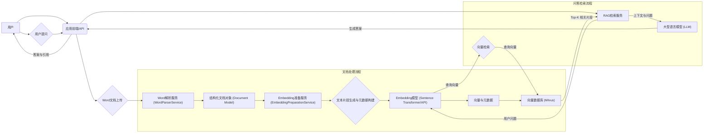
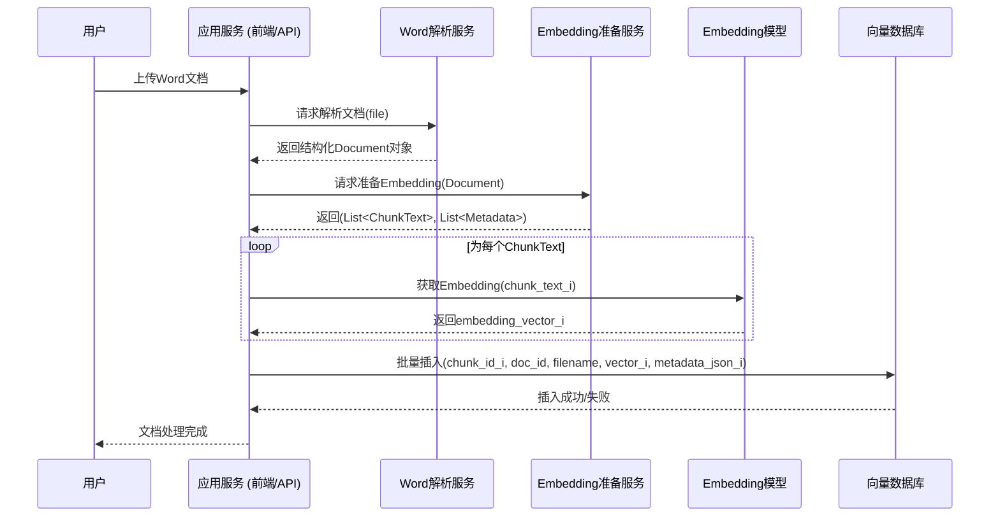
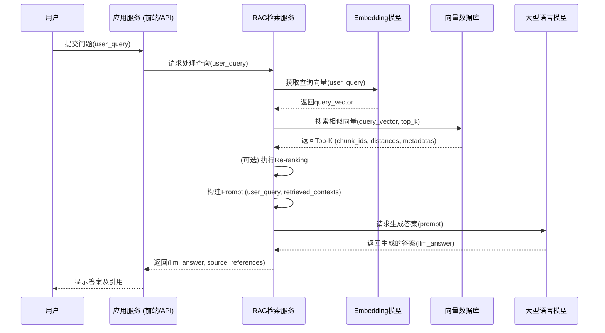

# 基于Word文档解析的RAG知识库系统设计文档

## 1. 系统概述

本系统旨在将用户上传的Word文档（.docx格式）进行深度解析、内容提取、向量化（Embedding），并结合大型语言模型（LLM）构建一个检索增强生成（RAG）的个人知识库应用。用户可以通过自然语言提问，系统能够从文档内容中检索相关信息并生成准确的答案。

## 2. 系统目标

*   **高效文档解析：** 准确提取Word文档中的文本、段落、标题、表格、图片描述等元素。
*   **语义化内容分块：** 将解析后的内容切分为大小适中、语义完整的文本片段。
*   **高质量向量化：** 将文本片段转换为高质量的向量表示，并存储于向量数据库。
*   **精准信息检索：** 用户提问时，能快速、准确地从向量数据库中检索到最相关的文本片段。
*   **智能答案生成：** 利用LLM结合检索到的上下文信息，生成流畅、准确的答案。
*   **可追溯性：** 生成的答案应能追溯到原始文档的具体位置。

## 3. 系统架构



## 4. 核心模块设计

### 4.1. Word解析服务 (`WordParserService`)

*   **输入：** 用户上传的`.docx`文件 (`MultipartFile` 或 `InputStream`)。
*   **核心逻辑：** (基于您已实现的 `WordParserServiceImpl`)
    *   使用Apache POI解析Word文档。
    *   提取文档元数据 (`DocumentMetadata`)。
    *   识别标题层级 (H1-H6)，构建章节 (`Chapter`) 和节 (`Section`) 结构。
    *   提取段落 (`Paragraph`)、表格 (`Table`)、图片 (`Image`) 等块级元素 (`Block`)。
    *   为每个块生成唯一ID，并记录其在文档结构中的位置。
*   **输出：** 结构化的 `Document` 对象，包含所有解析出的内容和层级信息。

### 4.2. Embedding准备服务 (`EmbeddingPreparationService`)

*   **输入：** `Document` 对象。
*   **核心逻辑 - 文本分块 (Chunking)：**
    1.  **遍历文档结构：** 遍历 `Document` -> `Chapter` -> `Section` -> `Block`。
    2.  **文本片段生成策略：**
        *   **段落 (`Paragraph`)：**
            *   `chunk_text`: "[章节标题]\n[节标题]\n[段落文本内容]"
            *   **长度控制：** 若段落文本过长（如超过512 Tokens），考虑按句子分割，并应用重叠分块（如重叠1-2个句子）。
        *   **表格 (`Table`)：**
            *   `chunk_text`: "[章节标题]\n[节标题]\n表格标题（如有）：[Caption]\n[表格内容的Markdown或文本化表示，例如：列头，然后每行内容]"
            *   对于非常大的表格，可以考虑仅Embedding关键行或表格摘要。
        *   **图片 (`Image`)：**
            *   `chunk_text`: "[章节标题]\n[节标题]\n图片描述：[Image.description]"
            *   若无描述，可跳过或标记。
        *   **H3-H6标题：** 由于已作为 `Paragraph` 处理，其文本（标题内容）会自然被包含，并带有父级H1、H2上下文。
    3.  **元数据构建：** 为每个生成的文本片段构建详细的元数据。
*   **输出：** 一系列待Embedding的文本片段对象，每个对象包含：
    *   `chunk_id` (String): 唯一片段ID (e.g., `docId_blockId_chunkIndex`)。
    *   `document_id` (String): 原始文档ID。
    *   `original_filename` (String): 原始文件名。
    *   `chunk_text` (String): 待Embedding的文本内容。
    *   `metadata` (Object): 包含章节ID/标题、节ID/标题、块ID、块类型、原始文本（若分块）、在父块中顺序等。

### 4.3. Embedding模型

*   **选择：**
    *   开源模型：如 `m3e-base`, `bge-large-zh-v1.5`, `e5-large-v2` (Sentence Transformers库)。
    *   商业API：如 OpenAI `text-embedding-3-small` / `text-embedding-3-large`。
*   **调用：** 将 `EmbeddingPreparationService` 输出的 `chunk_text` 列表送入选定的Embedding模型，生成对应的向量。

### 4.4. 向量数据库 (Milvus)

#### 4.4.1. Milvus Collection 设计

*   **Collection Name:** `word_document_embeddings` (或类似名称)
*   **Fields:**
    1.  `chunk_id`:
        *   `DataType`: `VARCHAR`
        *   `is_primary_key`: `true`
        *   `max_length`: 256 (根据实际ID生成策略调整)
        *   `description`: "文本片段的唯一ID"
    2.  `document_id`:
        *   `DataType`: `VARCHAR`
        *   `max_length`: 128
        *   `description`: "原始文档的ID"
        *   `index_name` (可选): `idx_document_id` (若常按文档ID过滤)
    3.  `original_filename`:
        *   `DataType`: `VARCHAR`
        *   `max_length`: 256
        *   `description`: "原始Word文档的文件名"
    4.  `chunk_text_hash` (可选，用于去重或快速校验):
        *   `DataType`: `VARCHAR`
        *   `max_length`: 64 (e.g., SHA256的前缀)
        *   `description`: "chunk_text内容的哈希值"
    5.  `embedding_vector`:
        *   `DataType`: `FLOAT_VECTOR`
        *   `dim`: (取决于所选Embedding模型的维度，例如 768, 1024, 1536, 3072)
        *   `index_name`: `idx_embedding_vector`
        *   `metric_type`: `L2` 或 `IP` (内积，常用于归一化向量) - 根据Embedding模型推荐选择
        *   `index_type`: `HNSW`, `IVF_FLAT`, `FLAT` 等 (根据数据量和查询需求选择，`HNSW` 常用)
    6.  `metadata_json`: (存储为JSON字符串，便于扩展)
        *   `DataType`: `VARCHAR` (或 `JSON` 如果Milvus版本支持更佳的JSON类型)
        *   `max_length`: (足够大，如4096或更大，取决于元数据复杂度)
        *   `description`: "包含章节、节、块信息等的JSON对象字符串"
        *   **JSON结构示例:**
            ```json
            {
              "chapter_id": "ch_doc1_abc",
              "chapter_title": "第一章：引言",
              "section_id": "sec_doc1_def",
              "section_title": "1.1 背景介绍",
              "block_id": "blk_para_doc1_001",
              "block_type": "PARAGRAPH",
              "order_in_parent": 0,
              "source_text_preview": "这是段落的开头部分文本..." // 可选，用于快速预览
            }
            ```
*   **Partition (可选):** 如果文档量非常大，可以考虑按 `document_id` 或上传日期进行分区，以优化管理和查询。

#### 4.4.2. Milvus 索引参数示例 (以HNSW为例)

```json
{
  "index_type": "HNSW",
  "metric_type": "L2", // 或 IP
  "params": {
    "M": 16,       // HNSW图中每个节点的最大边数
    "efConstruction": 200 // 构建索引时的搜索范围参数
  }
}
```
搜索时的参数 `ef` (搜索范围)也需要调整以平衡召回率和速度。

### 4.5. RAG检索服务

*   **输入：** 用户的问题 (String)。
*   **核心逻辑：**
    1.  **查询向量化：** 将用户问题通过与文档Embedding相同的模型转换为查询向量。
    2.  **向量检索：**
        *   在Milvus的 `word_document_embeddings` Collection中，使用查询向量执行相似度搜索（ANN search）。
        *   指定 `top_k` (例如，返回5或10个最相关的结果)。
        *   可以结合元数据进行预过滤（例如，如果用户指定了特定文档或章节）。
    3.  **结果处理与上下文构建：**
        *   获取检索到的文本片段 (`chunk_id`, `embedding_vector`, `metadata_json`)。
        *   解析 `metadata_json` 以获取完整的上下文信息。
        *   **可选 - 重排 (Re-ranking)：** 使用Cross-Encoder模型对初步检索到的Top-K结果与用户查询进行重新打分和排序，以提高最相关结果的排序。
        *   **构建Prompt上下文：** 将最相关的几个文本片段（其 `chunk_text` 可以从数据库检索或根据 `chunk_id` 从缓存/原始存储中获取）及其元数据信息（如标题）组织成清晰的上下文段落。
*   **输出：** 准备好的Prompt（包含用户问题和检索到的上下文）以及检索到的原始片段信息（用于引用）。

### 4.6. 大型语言模型 (LLM)

*   **选择：** GPT系列 (OpenAI), Llama系列, Claude, 或其他可用的闭源/开源LLM。
*   **输入：** RAG检索服务构建的Prompt。
*   **核心逻辑：** 根据提供的上下文和用户问题生成答案。
*   **输出：** 自然语言答案。

## 5. 业务流程

### 5.1. 文档处理与Embedding流程



### 5.2. 用户问答与RAG检索流程



## 6. 如何Embedding

1.  **选择模型：** 根据语言、性能需求和预算选择合适的Embedding模型。
2.  **文本预处理：**
    *   `EmbeddingPreparationService` 生成的 `chunk_text` 应尽可能干净。
    *   移除不必要的特殊字符（除非它们具有语义）。
    *   确保文本编码一致（UTF-8）。
3.  **API调用/库使用：**
    *   **HuggingFace Sentence Transformers:**
        ```python
        from sentence_transformers import SentenceTransformer
        model = SentenceTransformer('your-chosen-model-name') # e.g., 'm3e-base'
        embeddings = model.encode(list_of_chunk_texts)
        ```
    *   **OpenAI API:**
        ```python
        from openai import OpenAI
        client = OpenAI(api_key="YOUR_API_KEY")
        response = client.embeddings.create(
            input=list_of_chunk_texts,
            model="text-embedding-3-small" # or other models
        )
        embeddings = [item.embedding for item in response.data]
        ```
4.  **向量归一化（可选但推荐）：** 某些模型（特别是用于内积相似度计算的）可能需要/受益于向量归一化。
5.  **批量处理：** 为了效率，尽可能批量将文本片段送入Embedding模型。

## 7. 未来优化方向

*   **混合搜索：** 结合向量检索和关键词检索（如BM25）。
*   **自适应分块与上下文窗口管理：** 更智能地处理不同长度的文本块和LLM的上下文限制。
*   **查询理解与重写：** 使用LLM改进用户查询。
*   **多模态支持：** 若Word文档中图片内容重要，考虑引入多模态模型处理图片。
*   **用户反馈循环：** 收集用户对检索结果和答案的反馈，用于持续优化系统。
*   **知识图谱结合：** 对于文档中结构化的实体和关系，可以考虑构建知识图谱与向量检索互补。
